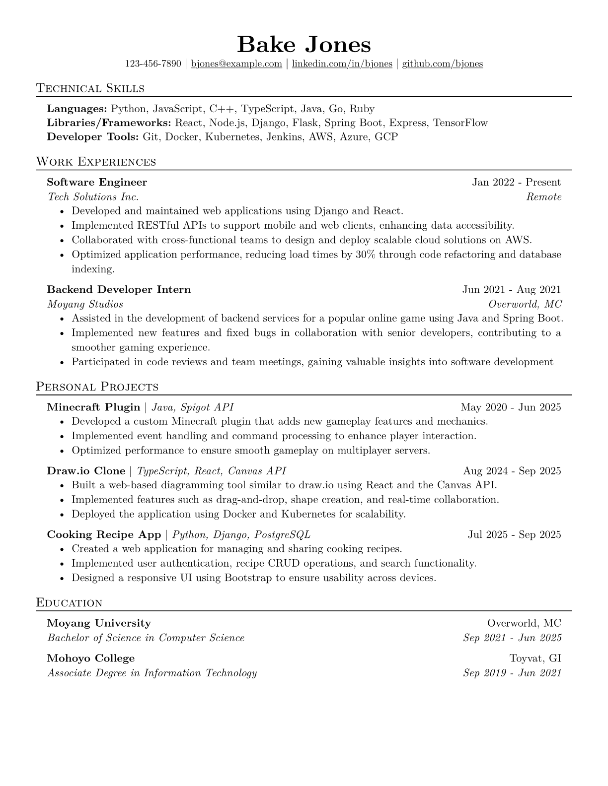

# bakes-resume
bakes resume, writtin in Typst!



## Usage
- fork the repo and edit the `resume.typ` file.
- look through `example.typ` for a sample resume.

## Typst CLI
```
# Watch
typst watch resume.typ

# Compile to resume.typ
typst compile resume.typ
```